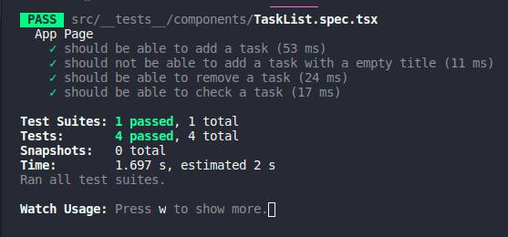

	

	<h1>React JS Concepts</h1>

### Summary

- [About the challenge](#about-the-challenge)

- [Tests](#Tests)

### About the challenge

- An application to manage todos. [Click here](https://github.com/felipejsborges/ignite-1th-challenge-reactjs-main/commit/345fa3fa4b2f990991dc51f14f82d1e6cf207954) to see the implementation.

### Tests

- **`should be able to add a task`**

- **`should not be able to add a task with a empty title`**

- **`should be able to remove a task`**

- **`should be able to check a task`**
 

	
	

by Felipe Borges 
[LinkedIn](https://www.linkedin.com/in/felipejsborges) | [GitHub](https://github.com/felipejsborges)
